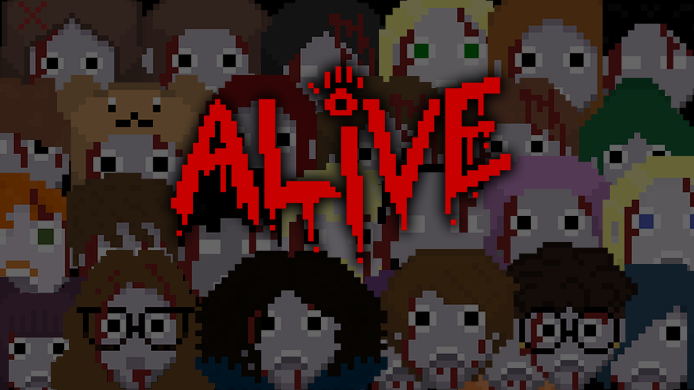
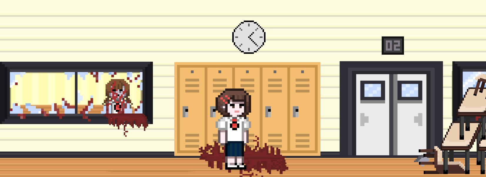

# Alive 🧟🎮
Este repositório contém a versão de demonstração do projeto Alive, um jogo de plataforma 2D de progressão vertical. 🕹️ O projeto foi desenvolvido como Trabalho de Conclusão de Curso (TCC) para a obtenção do título de Técnico de Nível Médio em Desenvolvimento de Sistemas na ETEC Prof.ª Anna de Oliveira Ferraz.

  

---

# Conceito do Jogo 🧟‍♂️
Alive é um jogo de plataforma 2D com estilo visual em pixel art, focado em uma experiência de imersão através da ambientação e do design sonoro. A narrativa do jogo se desenrola durante um apocalipse zumbi, onde o jogador assume o papel de um sobrevivente tentando escapar subindo um prédio. 🏢 O jogo se diferencia por oferecer mecânicas simples e intuitivas, evitando habilidades "sobre-humanas" e proporcionando uma jogabilidade acessível.

  

---

# Tecnologias Utilizadas 💻
O desenvolvimento do projeto foi realizado com as seguintes tecnologias e ferramentas:

- Motor Gráfico: Unity
- Linguagem de Programação: C#
- Design Gráfico: A arte do jogo foi desenvolvida em estilo pixel art.

---

# Status do Projeto 🚧
Esta é uma versão de demonstração que inclui apenas a primeira fase, ambientada em uma escola. 🏫 O foco do desenvolvimento foi a conclusão de uma fase de alta qualidade que atendesse a todos os requisitos do TCC. Embora o projeto inicial fosse mais complexo, esta versão funcional e polida demonstra o potencial do conceito e das tecnologias utilizadas.

Os arquivos disponíveis neste repositório correspondem aos builds do jogo, prontos para serem executados. 🚀
